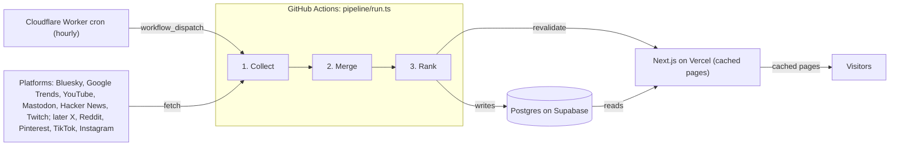

# Top 10 Social Trends: Implementation Plan

Synced with the Claude Docs plan on 2026-09-29; prices and limits were checked on 2026-09-28. This file is the source of truth for the build: update it whenever a decision changes.

One hourly job pulls trend lists from six free sources, merges matching topics, and publishes each platform's top 10 plus a combined top 10. It costs $0 a month on free tiers and takes about 8 part-time weeks; adding X and AI topic names costs about $18 a month. Reddit needs approval, TikTok, Instagram and Pinterest are read through scrapers, and Facebook, Threads and LinkedIn offer no trend source an individual can use.

## What the site does

Visitors get one merged top 10 across all platforms on the home page, plus a separate top 10 for each platform, refreshed every hour and covering English-language trends in the US and worldwide.

| Page | Route | What it shows |
| --- | --- | --- |
| Home | `/` | From phase 1, a dashboard: the biggest numbers, each platform's top 3, what is new since the last hour, climbers and staying power. From phase 2, the combined top 10 above it: topic name, one line of context (a Google Trends headline, or a Claude summary on Starter), badges for the platforms where it appears, rank change vs. 24 hours ago |
| Platform | `/p/[platform]` | That platform's own top 10, in its own order, each linking to the original trend, search or post |
| Topic | `/t/[slug]` | Where the topic is trending, its rank history over 7 days, the top 3–5 links per platform |
| Archive | `/archive/[date]` | Hourly snapshots of past top 10s (per-platform lists only for the last 28 days) |
| Status | `/status` | Last successful fetch per source and 24-hour success rate, so a stale list is labeled instead of silently wrong |

Version 1 shows one English-language list. A Global / US toggle arrives with X in phase 3, when X's Worldwide and US lists make the two views differ and Google Trends and YouTube can add UK, Canada and Australia feeds to Global. Accounts, alerts and sentiment scoring stay out of scope; each can be added later without changing the data model.

## Data sources

Six sources are free and need no approval, so they form the MVP. X costs $0.010 per request, Reddit needs approval, and TikTok, Instagram and Pinterest are read through scrapers.

| Platform | Trending signal | Access | Cost | Region | Phase |
| --- | --- | --- | --- | --- | --- |
| [Bluesky](https://raw.githubusercontent.com/bluesky-social/atproto/main/lexicons/app/bsky/unspecced/getTrends.json) | `app.bsky.unspecced.getTrends` on `https://public.api.bsky.app`: topic, display name, link, post count, status, up to 25 | None; the endpoint is "unspecced", so it may change | Free | Global | 1 |
| [Google Trends](https://support.google.com/trends/answer/3076011) | "Trending now" RSS, `https://trends.google.com/trending/rss?geo=US`: query, approximate traffic, news headlines and links; the 10 newest trends, newest first (not the 10 biggest), refreshed about every 10 minutes | None; the official API is still a gated alpha | Free | Per country; no worldwide feed | 1 |
| [YouTube](https://developers.google.com/youtube/v3/docs/videos/list) | `videos.list?part=snippet,statistics&chart=mostPopular&regionCode=US`: title, views, likes; since July 2025 drawn from the music, movies and gaming charts | API key; stored data kept 30 days at most | Free; 1 quota unit per call of 10,000 a day | Per country; no global | 1 |
| [Mastodon](https://docs.joinmastodon.org/methods/trends/) | `GET /api/v1/trends/tags` on mastodon.social: tag, URL, daily uses and accounts, up to 20 | None; trends are per server | Free; 300 requests per 5 minutes per IP | Per server | 1 |
| [Hacker News](https://github.com/HackerNews/API) | `topstories.json`, then `item/{id}.json`: title, URL, score, comment count | None | Free; no rate limit | Global, tech audience | 1 |
| [Twitch](https://dev.twitch.tv/docs/api/reference/) | `GET /helix/games/top` (games sorted by live viewers) and `GET /helix/streams` | App access token (client credentials) | Free | Global | 1 |
| [X](https://docs.x.com/x-api/trends/get-trends-by-woeid) | `GET /2/trends/by/woeid/{woeid}`: trend name, post count, up to 50 (default 20) | Developer account with pay-per-use credits | [$0.010 per request](https://docs.x.com/x-api/getting-started/pricing): $14.40 a month hourly for 2 regions | Worldwide (WOEID 1), US (23424977) | 3 |
| [Reddit](https://support.reddithelp.com/hc/en-us/articles/42728983564564-Responsible-Builder-Policy) | `/r/popular/hot` or `/r/all/top?t=hour` on `oauth.reddit.com`: title, score, comments, subreddit, NSFW flag | OAuth app plus explicit approval; non-commercial use goes through a sign-up form | Free; 100 queries per minute | Global | 3, once approved |
| [Pinterest](https://trends.pinterest.com/) | Pinterest Trends' growing search keywords over 30 days: term, rank, a 0–100 search index, weekly, monthly and yearly change; the site refreshes weekly | The [Apify actor automation-lab/pinterest-trends-scraper](https://apify.com/automation-lab/pinterest-trends-scraper), which reads the public Trends site. Pinterest's [own API](https://developers.pinterest.com/docs/getting-started/access-tiers/) (`GET /v5/trends/keywords/{region}/top/{trend_type}`) is free but needs a business account and app review, so it can replace the scraper later | ≈ $0.26 a month: 25 keywords twice a week at $0.03 a run, inside Apify's free $5 | US and country groups | 3, optional |
| [TikTok](https://ads.tiktok.com/creative/creativeCenter/trends/hashtag) | Creative Center hashtags over a 7-day window; no API for individuals (the Research API is academic-only) | Third-party scraper: the [Apify actor data_xplorer/tiktok-trends](https://apify.com/data_xplorer/tiktok-trends), since Creative Center shows logged-out visitors only its top 3 and other actors return just those; TikTok's terms ban scraping | ≈ $1.70 a month: 30 hashtags daily at $0.055 a run ($0.025 plus $0.001 a hashtag), inside Apify's free $5 | Per country | 3, optional |
| [Instagram](https://www.instagram.com/explore/) | Instagram's public trending topics (`instagram.com/popular/<topic>/`): topic, rank, all-time post count; no API (Meta's [hashtag search](https://developers.facebook.com/docs/instagram-platform/instagram-api-with-facebook-login/hashtag-search/) only looks up hashtags you name, 30 per 7 days) | Third-party scraper: the [Apify actor s-r/instagram-trending-scraper](https://apify.com/s-r/instagram-trending-scraper), new in 2026 and unproven; Instagram's terms ban scraping | ≈ $2.40 a month: 10 topics every 6 hours at $0.02 a run (the free plan caps a run at 10), inside Apify's free $5 | Global only | 3, optional |

Facebook, Threads and LinkedIn are left out because none offers a trends source an individual can use. [Threads keyword search](https://developers.facebook.com/docs/threads/keyword-search/) needs app approval, Facebook [removed Trending in 2018](https://about.fb.com/news/2018/06/removing-trending/), and [LinkedIn's self-serve API](https://learn.microsoft.com/en-us/linkedin/shared/authentication/getting-access) covers only profiles and posting.

TikTok's actor also returns each hashtag's 7-day daily popularity curve (0–100) and an up/down direction. The collector passes them on as `TrendItem.series` and `flags.direction`; `trend_items` doesn't store them, and phase 5 keeps them for research (PLAN.md › Predictions and research).

**Source cadence log.** Forecasting models need each source sampled the same way for weeks, so record every change to a scheduled source here: the date, what changed, and the resulting cadence, depth and window. Research cuts its data at these points. Sources the hourly pipeline fetches directly are sampled hourly, from their first run.

| Date (UTC) | Source | Change | Cadence | Depth | Window |
| --- | --- | --- | --- | --- | --- |
| 2026-09-30 22:07 | X | First pipeline run (Worldwide and US) | Hourly at :07 | 20 trends per region | Live |
| 2026-10-01 06:00 | TikTok | First scheduled run of data_xplorer/tiktok-trends (test runs on 2026-09-30 21:22 with 15 hashtags and 21:47 with 30) | Daily at 06:00 | 30 US hashtags | 7 days |
| 2026-10-01 07:00 | Pinterest | First scheduled run of automation-lab/pinterest-trends-scraper (test run on 2026-09-30 21:55) | Mondays and Thursdays at 07:00 | 25 growing US keywords | 30 days |
| 2026-09-30 21:50 | Instagram | One-day turnover test of s-r/instagram-trending-scraper, ending 2026-10-01 21:50; the lasting cadence is set from its results | Hourly at :50 | 10 topics (free-plan cap) | Current list |

## Cost tiers

Start free; the Starter tier, about $18 a month, is the best value because X's live trends and AI topic names make the combined list much stronger.

| Tier | Monthly cost | Platforms | What it includes |
| --- | --- | --- | --- |
| Free | $0 | Bluesky, Google Trends, YouTube, Mastodon, Hacker News, Twitch; Reddit once approved | Free APIs and hosting (Vercel, Supabase, GitHub Actions, Cloudflare), a local embedding model, topic names taken from trend lists |
| Starter | ≈ $18 | Free tier + X | X trends hourly for Worldwide and US ($14.40), [Claude Haiku 4.5](https://platform.claude.com/docs/en/about-claude/pricing) topic names and one-line summaries (≈ $3.24), [OpenAI embeddings](https://developers.openai.com/api/docs/pricing) (≈ $0.06) |
| Plus | ≈ $18 | Starter + TikTok, Instagram and Pinterest | TikTok's top 30 US hashtags (7-day window) daily, Instagram's top 10 trending topics every 6 hours and Pinterest's 25 growing US keywords twice a week via Apify actors: about $4.40 of usage a month together, inside [Apify's free plan](https://apify.com/pricing) ($5 a month, which blocks rather than bills beyond it; no subscription); the platforms' terms ban scraping |

Above about $25, money mostly buys refresh speed (X every 15 minutes costs $57.60 a month) or enterprise listening data, which a personal top 10 does not need. Estimates assume a 30-day month of 720 hourly runs and about 5 new topics an hour to name, at roughly 600 input and 60 output tokens each.

## Architecture



Page views never call a platform API: each run writes to Postgres and then asks Vercel to refresh the cached pages, so a slow or failing source can't slow the site down.

Each run: (1) **Collect**: every enabled collector fetches its list in parallel and returns `TrendItem[]`; (2) **Merge**: normalize, filter, embed and match items to topics; (3) **Rank**: write per-platform and combined rankings, purge rows older than 28 days, then call the site's revalidation endpoint.

## Tech stack

Use TypeScript end to end: one Next.js app for the site plus a folder of collector scripts that run every hour, all on free tiers.

| Layer | Free pick | Limit that matters | Upgrade |
| --- | --- | --- | --- |
| Website | Next.js (App Router) on [Vercel Hobby](https://vercel.com/docs/plans/hobby); pages cached and revalidated after each run | Personal, non-commercial use only; 4 CPU-hours and 1M function invocations a month, so serve cached pages | [Vercel Pro](https://vercel.com/pricing), $20 a month, if you add ads or sponsors |
| Scheduler | A [Cloudflare Workers Free](https://developers.cloudflare.com/workers/platform/limits/) cron that starts a GitHub Actions `workflow_dispatch` run every hour, in a public repo with keys kept in repository secrets | Standard runners are [free for public repos](https://docs.github.com/en/billing/concepts/product-billing/github-actions); the trigger is one API call an hour, within Workers Free's 5 cron triggers and 10 ms of CPU | A [$4 a month DigitalOcean droplet](https://www.digitalocean.com/pricing/droplets) running system cron |
| Database | Postgres on [Supabase Free](https://supabase.com/pricing) with Drizzle ORM | 500 MB database and 5 GB egress; pauses after a week without activity, which the hourly job prevents. This design needs about 39 MB | Supabase Pro, $25 a month |
| Topic matching | Local embedding model (`Xenova/all-MiniLM-L6-v2` via Transformers.js, English only) | Pick the model before phase 2: switching later means re-embedding topic centroids and re-tuning the threshold | [OpenAI text-embedding-3-small](https://developers.openai.com/api/docs/models/text-embedding-3-small), $0.02 per 1M tokens (≈ $0.06 a month) |
| Topic names | The top lead-source item's text, with a Google Trends headline as context | Raw hashtags read awkwardly, and not every topic has a headline | [Claude Haiku 4.5](https://platform.claude.com/docs/en/about-claude/pricing) (`claude-haiku-4-5-20251001`), $1 / $5 per 1M input / output tokens (≈ $3.24 a month) |

Vercel's Hobby cron runs [at most once a day](https://vercel.com/docs/cron-jobs/usage-and-pricing), so it can't drive an hourly job. GitHub's own scheduler can drop runs at busy times and turns off public-repo schedules after 60 idle days; a Cloudflare trigger avoids both. Neon Free was ruled out because it meters compute at [100 CU-hours a month](https://neon.com/docs/introduction/plans), which crawler traffic waking the database could use up.

Supabase connections: the direct host is IPv6-only without a paid add-on, and GitHub's hosted runners are IPv4-only, so use the [pooler strings](https://supabase.com/docs/guides/database/connecting-to-postgres). The website on Vercel uses the transaction pooler (port 6543, prepared statements off, one connection); the hourly pipeline and migrations use the session pooler (port 5432). The database is in `us-east-2` (Ohio), so the Vercel functions run in Cleveland (`cle1`), in the same region.

Page caching uses Next.js 16 without Cache Components, because `next build` must never query the database. Dynamic routes (`/p/[platform]`, later `/t/[slug]`) are ISR pages: `generateStaticParams` returns `[]`, so each page renders on its first visit and is then served from cache. Static routes (`/` and `/status`) would be prerendered at build time, so they call `connection()` to render per request and read through `unstable_cache` under the `trends` tag, so a visit rarely reaches Postgres. `POST /api/revalidate` expires that tag and revalidates the page paths after each run. `unstable_cache` is superseded by `'use cache'` in Next.js 16; the Cache Components version would need `'use cache: remote'` for a durable shared cache on Vercel, so revisit this if `unstable_cache` is removed.

## Ranking

Each platform's top 10 keeps that platform's own order; the combined top 10 rewards topics that rank high on several platforms, led by sources that report live trends.

**Per-platform top 10.** Show the first 10 items in the order the source returns them, after filters. X, Bluesky, Mastodon, Twitch, Pinterest, TikTok and Instagram return ranked trend lists; Reddit, YouTube and Hacker News return ranked posts or videos, shown as they are. Google Trends is the exception, below.

**Google Trends window.** Google's "Trending now" feed lists its 10 newest US trends, newest first, not its 10 biggest: on 2026-09-30 the Astros, at 50,000+ searches, sat at #7 under five trends of 500 to 5,000, and on a busy afternoon the whole list turns over within an hour (found by the predictions work, research/findings/rq5-rhythms.md). So Google's list is every trend it published in the last 3 hours (the same freshness limit as every list), one entry per query at its latest sighting, ranked by approximate traffic, then by the newer sighting, then by feed position. The collector keeps the feed's order (invariant 3); `lib/window.ts` ranks the window, and the combined score, topic snapshots, the Google Trends page and the dashboard all use it. Decided by the owner on 2026-09-30.

**Combined top 10**, recomputed every run:

1. Take each source's latest list only if it was fetched in the last 3 hours, so a dead collector stops counting.
2. Normalize: lowercase, strip `#` and URLs, split hashtags such as `#WorldSeries` into words, and attach Google Trends' news headlines to their query as extra matching text.
3. Filter: keep English items, using a language detector suited to short text plus a Latin-script check. Drop Reddit posts flagged NSFW, Bluesky trends whose status is cooling or stale, profanity, and evergreen tags such as #MondayMotivation.
4. Embed each item and assign it to the nearest topic from the last 48 hours when cosine similarity is at least the threshold (starting value 0.80, set in `config/ranking.ts` and tuned in task 2.9; see *Matching threshold* below); otherwise it starts a new topic. Matching against topic centroids, never item to item, stops unrelated items chaining together.
5. Score each topic with the formula below and keep the 10 highest.
6. Name new topics from a lead-source item (an X trend, Google query, Bluesky topic or Mastodon tag), never from a video or post title. On Starter, Claude Haiku 4.5 writes the name and a one-line reason.

```math
\text{score}(T) = \sum_{p \in P(T)} \frac{w_p}{\log_2(r_{T,p} + 1)}
```

P(T) is the set of platforms where topic T appears, r is its best rank there, and w is the platform's weight. The log decay ignores list length, so #10 counts 0.29 of #1 on every platform. A topic at #1 on X alone scores 1.0; one at #1 on X, #3 on Google Trends and #5 on Reddit scores 1.81.

| Role | Platforms and starting weights |
| --- | --- |
| Lead sources | X 1.0, Google Trends 1.0, Reddit 0.8, Bluesky 0.5, Mastodon 0.3 |
| Corroborating only | YouTube 0.8, TikTok 0.5, Instagram 0.5, Twitch 0.3, Hacker News 0.3, Pinterest 0.3 |

Corroborating sources count only when a lead source also has the topic, which keeps music videos and evergreen games out of the combined list. Instagram's trending topics read like search terms ("mlb playoffs", "national coffee day"), so it could become a lead source, but it starts as corroborating because its scraper is new and its list is refreshed only every 6 hours; revisit this with the phase 2 eval output. On the Free tier the combined list leans on Google Trends and Bluesky, and it gets much stronger once X and Reddit join; tune the weights by eye in phase 2.

The rank step runs after the lists are saved, in its own error handler, so a failure in filtering, embedding or matching never costs the lists, the heartbeat or the page refresh. Filters run in memory because the flags and headlines they read are not stored. Each platform's page shows its list after filters, renumbered 1 to 10; the combined score uses each item's original rank.

**Matching threshold.** The model is `Xenova/all-MiniLM-L6-v2` with 8-bit weights (23 MB), chosen on 2026-09-30. Measured with it, the same story worded differently scores about 0.65 to 0.70 ("world series" against "dodgers win game 4 of the world series": 0.70), a related but different topic about 0.63 ("baseball"), and unrelated text about 0.2. A first probe of one hour of real lists merged only correct pairs, and only at 0.55 to 0.65 (Deadlock on Bluesky and Twitch; Flydubai on Bluesky and Mastodon). So 0.80 is too strict for this model. `npm run replay -- tune` replays the stored lists at several thresholds. On the first 10 hours (2026-09-30), 0.60 merged only correct pairs, while 0.55 began merging related but different stories (a GTA VI article with older GTA games on Twitch; two different GPT-6.1 stories). Task 2.9 confirms the value on a week of data. Once phase 2 is live, `npm run replay -- rebuild` backfills topics, rankings and snapshots for the hours before it, while the stored lists still cover them.

**Regions.** Each stored list keeps its feed's real region: `us` for Google Trends and YouTube (plus `gb`, `ca` and `au` from phase 3) and `global` for Bluesky, Mastodon, Hacker News, Twitch and Instagram. Until phase 3 the site has one view, stored as `global` and built from every list. From phase 3 there are two views. US uses X's US list, the US feeds and the global lists. Global uses X's Worldwide list, the global lists, and Google Trends and YouTube for the US, UK, Canada and Australia. Per-platform pages show a source's global feed, or its US feed when it has no global one.

## Data model

Seven Postgres tables hold everything. Raw items are deleted after 28 days, inside YouTube's 30-day storage limit; combined rankings are kept for good.

| Table | Columns | Retention |
| --- | --- | --- |
| `sources` | `id` text PK (`x`, `google_trends`, `reddit`, `bluesky`, `mastodon`, `youtube`, `tiktok`, `instagram`, `twitch`, `hacker_news`, `pinterest`, `heartbeat`), `name` text, `role` text (`lead`, `corroborating`, `system`), `weight` real, `enabled` boolean, `regions` text[] | Permanent; upserted from `collectors/registry.ts` at the start of each run |
| `fetch_runs` | `id` bigserial PK, `source_id` text → sources, `region` text, `started_at` timestamptz, `finished_at` timestamptz, `status` text (`ok`, `error`, `skipped`), `item_count` int, `error` text | 90 days |
| `trend_items` | `id` bigserial PK, `run_id` bigint → fetch_runs, `source_id` text, `region` text, `rank` int, `title` text, `url` text, `metric_value` bigint, `metric_label` text, `fetched_at` timestamptz; index on (`source_id`, `region`, `fetched_at` desc) | 28 days |
| `topics` | `id` bigserial PK, `slug` text unique, `label` text, `summary` text (one line of context), `centroid` real[384], `first_seen` timestamptz, `last_seen` timestamptz | Permanent |
| `topic_items` | `topic_id` bigint → topics, `item_id` bigint → trend_items on delete cascade; PK (`topic_id`, `item_id`) | 28 days, with their items |
| `rankings` | `id` bigserial PK, `computed_at` timestamptz, `list` text (`combined` or a source id), `region` text, `rank` int, `topic_id` bigint → topics, `item_id` bigint → trend_items on delete cascade, `score` real; index on (`list`, `region`, `computed_at` desc) | Combined permanent; per-platform 28 days (cascades with items) |
| `topic_snapshots` | `taken_at` timestamptz, `region` text, `topic_id` bigint → topics, `position` int (place among scored topics, null without a lead platform), `score` real, `platform_count` int, `news_count` int (distinct Google Trends headlines attached that run), `algo_version` text (embedding model, threshold, ranking version, `+replay` for rebuilt hours), `ranks` jsonb (source → best rank), `metrics` jsonb (source → metric); PK (`topic_id`, `taken_at`, `region`); index on `taken_at` | Permanent, never with YouTube data |

In `trend_items` and `fetch_runs`, `region` is the feed's real region (`global` or `us`, plus `gb`, `ca` and `au` from phase 3); in `rankings` it is the view (`global` or `us`). At about 195 items per hourly run, `trend_items` holds roughly 131,000 rows at 28-day retention: about 39 MB, under 100 MB with indexes, well inside Supabase's 500 MB. Phase 3's extra country feeds raise this to about 300 items per run, or about 60 MB. Store only these columns rather than full API responses.

**Topic snapshots** record, every run, where each current topic stands on each platform: the hour-by-hour history a future prediction model needs (for example, whether a topic will break out to more platforms). Items are deleted after 28 days, so snapshots are the only lasting record, at about 50 rows an hour, or 6 MB a month. Each row names the method that made it (`algo_version`), so analyses survive retuning, and counts the news headlines attached to its topic (`news_count`), the first news signal for the research. Hours rebuilt from stored lists carry `+replay` and a news count of 0, because headlines are not stored. YouTube is left out entirely, including from the snapshot score: its developer policies (III.E.4) allow storing API data for at most 30 days and forbid using it "to create new or derived data or metrics". This is a personal MVP: the owner accepts the platforms' terms risk of using their data to train a personal model, and would revisit it if the site ever went commercial. The same clause also bears on YouTube's place in the combined score and topic matching. The owner decided on 2026-09-30 to keep YouTube there as planned for this personal MVP, and to leave it out of permanent snapshots only. Compute item embeddings inside the job instead of storing them; a few hundred items per run fit in memory, so pgvector is optional. Every table has row-level security turned on with no policies, so Supabase's public Data API exposes nothing; the site and pipeline connect as the table owner, which bypasses it.

## Predictions (phase 5)

Phase 5 turns the stored history into forecasts for creators and marketers planning content: is a topic worth making content about, and when? The same data also answers research questions about attention, such as how long topics last and which platform tends to have them first.

| Horizon | The creator's question | Forecast | Inputs |
| --- | --- | --- | --- |
| Hours (0–12) | "Should I post about this now?" | Rising or fading: the chance it reaches 3 or more platforms, or the combined top 3, within 6 hours | Topic snapshots: momentum, breadth, which platform had it first, `news_count` |
| Days (1–7) | "Will it still matter when my video is ready?" | Expected lifespan: hours left in the combined top 10 | The above, plus how similar past topics fared (nearest topic centroids) |
| Weeks (1–8) | "What goes on next month's calendar?" | Scheduled and recurring moments, and how big they were last time | Outside calendars and multi-year history (below); our own data can't see an event before it trends |

**Data.** Features come only from `topic_snapshots` (hourly, permanent, never YouTube), `topics` (labels, centroids, first and last seen) and the combined rankings. The hours and days models need 6 to 8 weeks of snapshots; the weeks horizon needs a year of our own data or outside history. Labels: *breakout* means reaching 3 or more platforms, or the combined top 3, within 6 hours of the forecast; *lifespan* means the hours until the topic last appears in the combined top 10. Each snapshot records its `algo_version`, so training can leave out rows made under an older threshold or ranking.

**Outside data**, added only when a horizon needs it, all free: Wikipedia pageviews (attention history since 2015, from the Wikimedia REST API), GDELT (news volume and tone, updated every 15 minutes), and event calendars: Nager.Date (holidays), TMDB (film and TV releases), IGDB (game releases, through the existing Twitch app) and TheSportsDB (fixtures). Each is a collector like the others: it only fetches and maps, runs in its own try/catch, and no page view ever calls it.

**Models.** Rules first, as baselines to beat (for example, "on 2 platforms within 2 hours of first appearing"). Then logistic regression for breakouts, and gradient-boosted trees or a survival model for lifespan, on tabular features. Training runs offline, on a computer or in a manual GitHub Actions job, and may use Python (scikit-learn, LightGBM) in a separate `research/` folder; that is a stack addition to confirm before task 5.4. The trained model ships as a small file in the repo (JSON coefficients, or ONNX run by the onnxruntime-node that Transformers.js already installs), and the hourly pipeline scores current topics in milliseconds. No paid API is involved.

**Evaluation.** Train on earlier weeks and test on later ones, never shuffled. Measure, for alerts, *precision* (how often a flagged topic does break out) and *lead time* (how many hours before it reached 3 platforms); for lifespan, the error in hours; and *calibration* (70% forecasts come true about 70% of the time). A public `/forecasts` page lists every forecast next to its outcome, so the accuracy is visible rather than claimed.

**Limits.** A month holds a few thousand topics and a few hundred breakouts: enough to learn from, not enough for precision. Sudden news gives no warning, so forecasts can only catch topics early in their rise. Platforms change and events are seasonal, so models are retrained regularly. Wrong topic merges become wrong labels, which is why phase 2's matching threshold is tuned first.

## Build phases

About 8 weeks at 6–10 hours a week gets the full site live; the per-platform lists can go public after week 4, once a 7-day soak passes. Detailed tasks are in `TASKS.md`.

| Phase | Weeks | Delivers | Gate |
| --- | --- | --- | --- |
| 0 · Setup | 1 | Repo, database, workflows, Cloudflare trigger, empty site on Vercel; Reddit and X applications sent | A heartbeat row lands every hour for 24 hours |
| 1 · Per-platform lists | 2–3 | Six collectors, platform and status pages, a dashboard home page, revalidation, 28-day purge | 7-day soak at 95% success per source (runs into week 4); lists go public |
| 2 · Combined top 10 | 4–5 | Normalization, filters, embeddings, topic matching, scoring, home and topic pages | In 5 random hours, at least 8 of 10 topics make sense, with no duplicates |
| 3 · Paid and approved sources | 6 | X with its spend cap, the Global / US toggle, Reddit when approved, optional TikTok, Instagram, Pinterest and Claude topic names | Projected monthly spend within your chosen tier |
| 4 · Polish and launch | 7–8 | Archive pages, share images, page titles, failure alerts, analytics | Launch and share the link |
| 5 · Predictions | After 6–8 weeks of snapshots | Rising or fading and lifespan forecasts for creators and marketers, a public forecast record, later a weeks-ahead calendar | On 4 held-out weeks, breakout alerts are right at least 60% of the time and come at least 2 hours early |

The 28-day purge sits in phase 1, not phase 4, so stored YouTube data never passes the 30-day limit.

## Risks

The biggest risks are a thin combined list on the Free tier, access changes at Reddit and X, and scraper breakage at TikTok and Instagram. Any source can be switched off with the `DISABLED_SOURCES` variable, and one failing source never blanks the site.

| Risk | Likelihood | Fallback |
| --- | --- | --- |
| The Free-tier combined list feels thin, because few free sources share topics | High | Add X in phase 3; attach Google Trends headlines to items to improve matching |
| Reddit delays or refuses API access (explicit approval required under its [Responsible Builder Policy](https://support.reddithelp.com/hc/en-us/articles/42728983564564-Responsible-Builder-Policy), updated June 2026) | High | Launch without Reddit; apply in week 1 and add it when approved |
| The TikTok scraper breaks, or TikTok enforces its [no-scraping terms](https://t.tiktok.com/legal/page/us/terms-of-service/en) | High | Keep TikTok optional, daily and flagged; drop it after 3 failed days in a row |
| The Instagram scraper breaks (it is new, with few users), Instagram reshapes its trending pages, or Instagram enforces its no-scraping terms | High | Keep Instagram optional (`INSTAGRAM_ENABLED`) and corroborating only, so losing it never changes which topics can appear; /status flags it after 18 hours without a successful run |
| Bluesky changes its "unspecced" trends endpoints | Medium | Count hashtags from the [Jetstream](https://bsky.network/docs/jetstream/) firehose instead |
| X changes pricing again (pay-per-use launched in February 2026) | Medium | Hard cap of 60 trend requests a day in code; X switches off when the cap is hit |
| Breaking a data policy, such as YouTube's [30-day storage rule](https://developers.google.com/youtube/terms/developer-policies) or missing attribution | Medium | Purge items at 28 days, never name topics from video titles, and link every item to its source |
| Duplicate or junk topics in the combined list | Medium | Centroid matching, English and profanity filters, threshold tuning, and a weekly look at 5 random hours |
| The scheduler misses runs | Low | Pages show "updated N min ago"; a $4 a month droplet with system cron is the fallback |
| Free-tier limits hit (Vercel 4 CPU-hours, Supabase 500 MB) | Low | Cached pages so visits rarely touch the database; the purge job keeps storage flat |

This is not legal advice; if the site ever turns commercial, re-read each platform's terms, since Reddit, Vercel Hobby and several APIs treat commercial use differently.

## Sources

Opened on 2026-09-28, except where noted.

**Platforms**

- [X API pricing](https://docs.x.com/x-api/getting-started/pricing), [trends by WOEID](https://docs.x.com/x-api/trends/get-trends-by-woeid), [rate limits](https://docs.x.com/x-api/fundamentals/rate-limits), [changelog](https://docs.x.com/changelog)
- [Reddit Responsible Builder Policy](https://support.reddithelp.com/hc/en-us/articles/42728983564564-Responsible-Builder-Policy), [Data API Wiki](https://support.reddithelp.com/hc/en-us/articles/16160319875092-Reddit-Data-API-Wiki), [Accessing Reddit data](https://support.reddithelp.com/hc/en-us/articles/14945211791892-Developer-Platform-Accessing-Reddit-Data)
- [YouTube videos.list](https://developers.google.com/youtube/v3/docs/videos/list), [revision history](https://developers.google.com/youtube/v3/revision_history), [quota](https://developers.google.com/youtube/v3/getting-started), [developer policies](https://developers.google.com/youtube/terms/developer-policies)
- [Bluesky getTrends lexicon](https://raw.githubusercontent.com/bluesky-social/atproto/main/lexicons/app/bsky/unspecced/getTrends.json), [rate limits](https://docs.bsky.app/docs/advanced-guides/rate-limits), [Jetstream](https://bsky.network/docs/jetstream/)
- [Mastodon trends API](https://docs.joinmastodon.org/methods/trends/), [rate limits](https://docs.joinmastodon.org/api/rate-limits/)
- [Google Trends "Trending now" help](https://support.google.com/trends/answer/3076011), [Google Trends API alpha](https://developers.google.com/search/apis/trends)
- [Twitch Helix API reference](https://dev.twitch.tv/docs/api/reference/), [Hacker News API](https://github.com/HackerNews/API)
- [Pinterest access tiers](https://developers.pinterest.com/docs/getting-started/access-tiers/), [rate limits](https://developers.pinterest.com/docs/reference/rate-limits/)
- [TikTok Research API](https://developers.tiktok.com/products/research-api/), [Creative Center hashtags](https://ads.tiktok.com/creative/creativeCenter/trends/hashtag), [terms of service](https://t.tiktok.com/legal/page/us/terms-of-service/en), [Apify TikTok trends actor](https://apify.com/data_xplorer/tiktok-trends)
- [Instagram hashtag search](https://developers.facebook.com/docs/instagram-platform/instagram-api-with-facebook-login/hashtag-search/), [Apify Instagram trending actor](https://apify.com/s-r/instagram-trending-scraper), [Threads keyword search](https://developers.facebook.com/docs/threads/keyword-search/), [Facebook removes Trending](https://about.fb.com/news/2018/06/removing-trending/), [LinkedIn API access](https://learn.microsoft.com/en-us/linkedin/shared/authentication/getting-access)

**Hosting and tools**

- [Vercel pricing](https://vercel.com/pricing), [Hobby plan](https://vercel.com/docs/plans/hobby), [cron limits](https://vercel.com/docs/cron-jobs/usage-and-pricing)
- [GitHub Actions schedule event](https://docs.github.com/en/actions/reference/workflows-and-actions/events-that-trigger-workflows), [Actions billing](https://docs.github.com/en/billing/concepts/product-billing/github-actions)
- [Supabase pricing](https://supabase.com/pricing), [Supabase connection guide](https://supabase.com/docs/guides/database/connecting-to-postgres) (opened 2026-09-29), [Neon plans](https://neon.com/docs/introduction/plans)
- [Cloudflare Workers limits](https://developers.cloudflare.com/workers/platform/limits/), [DigitalOcean Droplets pricing](https://www.digitalocean.com/pricing/droplets)
- [OpenAI API pricing](https://developers.openai.com/api/docs/pricing), [text-embedding-3-small](https://developers.openai.com/api/docs/models/text-embedding-3-small), [Claude API pricing](https://platform.claude.com/docs/en/about-claude/pricing), [Apify pricing](https://apify.com/pricing)
