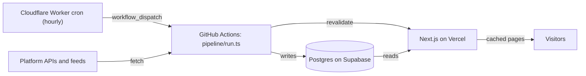

# Top 10 Social Trends

A personal, non-commercial website that shows the top 10 trending topics on each social platform, plus one combined cross-platform top 10. It refreshes every hour and covers English-language trends in the US and worldwide.

Status: phase 0 (setup). The plan is in [PLAN.md](PLAN.md) and the task list in [TASKS.md](TASKS.md).

## How it works



- A **Cloudflare Worker** (`worker/`) fires at minute 7 of every hour and starts the `collect` workflow through GitHub's workflow-dispatch API.
- The **pipeline** (`pipeline/run.ts`, run by `.github/workflows/collect.yml`) fetches every enabled source in parallel, merges matching topics, ranks them, writes to **Postgres on Supabase** and asks the site to refresh its cached pages.
- The **website** (Next.js on Vercel) reads the precomputed rows. Page views never call a platform API.

Sources: Google Trends, Bluesky, Mastodon, YouTube, Twitch and Hacker News first; X, Reddit, Pinterest, TikTok and Instagram later. See PLAN.md › Data sources.

## Setup

Accounts, API keys and secrets are listed step by step in [SETUP.md](SETUP.md).

## Run locally

Requires Node 22.

```bash
npm install
cp .env.example .env.local   # fill in the values you have
npm run dev                  # the site on http://localhost:3000
npm run pipeline -- --dry-run  # print what each source would do; needs no database
npm test
```

`npm run pipeline` (without `--dry-run`) and `npm run db:migrate` need `SESSION_DATABASE_URL`.
