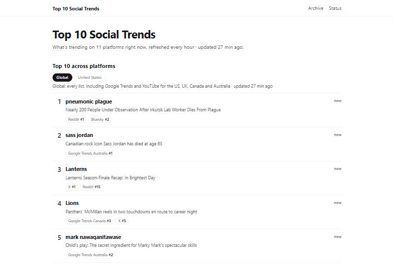
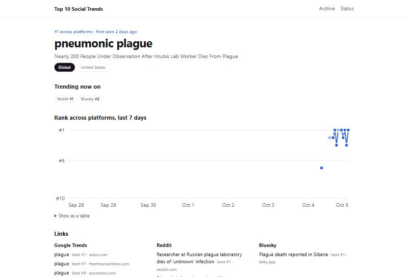
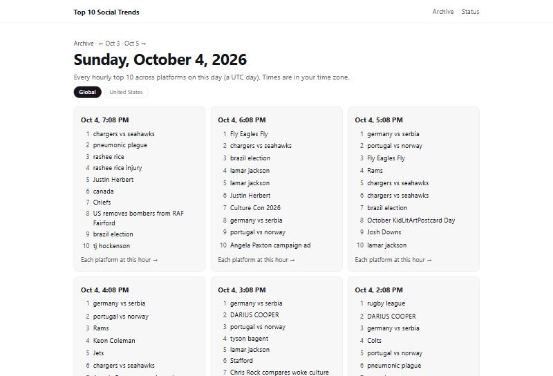
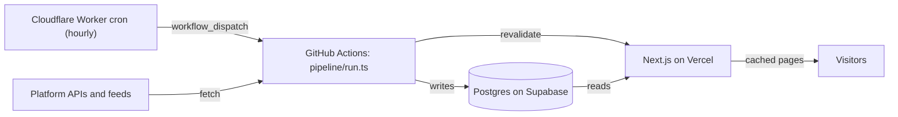

# Top 10 Social Trends

A personal, non-commercial website that shows the top 10 trending topics on each social platform, plus one combined cross-platform top 10. It refreshes every hour and covers English-language trends in the US and worldwide.

Live at **[top10-trends.vercel.app](https://top10-trends.vercel.app)**.



## What it shows

| Page | What you see |
| --- | --- |
| [Home](https://top10-trends.vercel.app/) | The combined top 10 across platforms, for a Global or a United States view, then each platform's top 3, what is new, what is climbing and what has stayed longest |
| [A platform](https://top10-trends.vercel.app/p/google-trends) | That platform's own top 10, in its own order, each linking to its source. Platforms with several feeds (Google Trends and YouTube by country, X for the US and worldwide) have a tab for each |
| A topic | Where the topic is trending now, its place across platforms over the last 7 days, and links to it on each platform |
| [Archive](https://top10-trends.vercel.app/archive) | Every hourly top 10 since the site began, day by day, and each platform's list for any hour of the last 28 days |
| [Status](https://top10-trends.vercel.app/status) | When each source last worked, its success rate, and what the site costs to run this month |

| A topic | A day in the archive |
| --- | --- |
|  |  |

## How it works



- A **Cloudflare Worker** (`worker/`) fires at minute 7 of every hour and starts the `collect` workflow through GitHub's workflow-dispatch API.
- The **pipeline** (`pipeline/run.ts`, run by `.github/workflows/collect.yml`) fetches every enabled source in parallel, filters the lists, matches items to topics, ranks them, writes to **Postgres on Supabase** and asks the site to refresh its cached pages. One failing source never fails a run.
- The **website** (Next.js on Vercel) reads the precomputed rows. Page views never call a platform API.

### The combined top 10

1. **Filter.** Keep English items; drop profanity, evergreen tags such as #MondayMotivation, and Bluesky trends that Bluesky itself marks stale.
2. **Match.** Each item joins a topic that has exactly its name ("#BahrainGP" and "bahrain gp" are one name). Otherwise it joins the nearest topic by meaning, using a small embedding model run inside the pipeline, or starts a new topic.
3. **Score.** A topic's score is the sum, over the platforms that list it, of `weight / log2(rank + 1)`. X, Google Trends, Bluesky and Mastodon can put a topic on the list; YouTube, Reddit, Instagram, Twitch, Hacker News and Pinterest only add to a topic one of those four already has. Only lists fetched in the last 3 hours count.
4. **Two views.** Global counts every list, with Google Trends' four countries ranked together by search volume. United States counts the US lists and the worldwide ones.

The reasons behind each rule are in [PLAN.md](PLAN.md).

## Data sources

Every list links back to its source. Stored items are deleted after 28 days.

| Source | What is read | How |
| --- | --- | --- |
| [X](https://x.com/explore) | Trends for the United States and worldwide | [X API](https://docs.x.com/x-api/trends/get-trends-by-woeid), pay per request |
| [Google Trends](https://trends.google.com/trending) | "Trending now" for the US, UK, Canada and Australia, with their news headlines | Its public RSS feeds |
| [Bluesky](https://bsky.app) | Trending topics | Bluesky's public API |
| [Mastodon](https://mastodon.social/explore/tags) | Trending hashtags on mastodon.social | Mastodon's public API |
| [YouTube](https://www.youtube.com) | Most popular videos in the US, UK, Canada and Australia | [YouTube Data API](https://developers.google.com/youtube/v3/docs/videos/list); never kept longer than 28 days or in the permanent history |
| [Reddit](https://www.reddit.com/r/popular/) | Post titles from r/popular | Its public Atom feed |
| [Twitch](https://www.twitch.tv/directory) | Top games and categories | [Twitch Helix API](https://dev.twitch.tv/docs/api/reference/#get-top-games) |
| [Hacker News](https://news.ycombinator.com) | Top stories | The [Hacker News API](https://github.com/HackerNews/API) |
| [TikTok](https://www.tiktok.com) | Top US hashtags of the week (shown on its page, not counted in the combined list) | An [Apify](https://apify.com) actor, once a day |
| [Instagram](https://www.instagram.com/explore/) | Trending topics | An Apify actor, three times a day |
| [Pinterest](https://www.pinterest.com/today/) | Growing US searches | An Apify actor, twice a week |

Also used:

- **Topic matching:** [`nomic-ai/nomic-embed-text-v1.5`](https://huggingface.co/nomic-ai/nomic-embed-text-v1.5), run locally in the pipeline with [Transformers.js](https://huggingface.co/docs/transformers.js).
- **Splitting hashtags into words:** word frequencies from [FrequencyWords](https://github.com/hermitdave/FrequencyWords) by Hermit Dave, built from OpenSubtitles 2018, under [CC BY-SA 4.0](https://creativecommons.org/licenses/by-sa/4.0/) (`config/words-en.txt`; see `config/words-en.NOTICE.md`).
- **Topic names** (optional): a short name, a one-line reason and a category from Claude Haiku 4.5, when an Anthropic API key is set.

This site is not affiliated with or endorsed by any of these platforms. Their names and trends belong to them.

## Run it locally

Requires Node 22.

```bash
npm install
cp .env.example .env.local   # fill in the values you have
npm run dev                  # the site on http://localhost:3000
npm run pipeline -- --dry-run  # fetch every enabled source and print its list; needs no database
npm test
```

- `npm run pipeline` (without `--dry-run`) and `npm run db:migrate` need `SESSION_DATABASE_URL`.
- A source whose keys are missing is skipped, so the free sources work with no keys at all.
- Accounts, API keys and secrets are listed step by step in [SETUP.md](SETUP.md).

## Layout

```
app/          the site's pages (Next.js App Router)
collectors/   one file per source
pipeline/     the hourly run: collect, filter, match, score, write
lib/          database queries, text and embedding helpers
db/           schema and migrations (Drizzle)
config/       ranking weights and thresholds, costs, blocklist
research/     Python notebooks for the forecasting work (never used by the site)
worker/       the Cloudflare Worker that starts each hourly run
```

## More

- [PLAN.md](PLAN.md): the design and the reason behind every decision.
- [TASKS.md](TASKS.md): the build, phase by phase.
- [SETUP.md](SETUP.md): accounts and keys.
- What it costs: about $15 to $18 a month, nearly all of it X's API; the rest runs on free tiers. The [status page](https://top10-trends.vercel.app/status) shows the current month.
